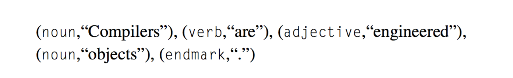
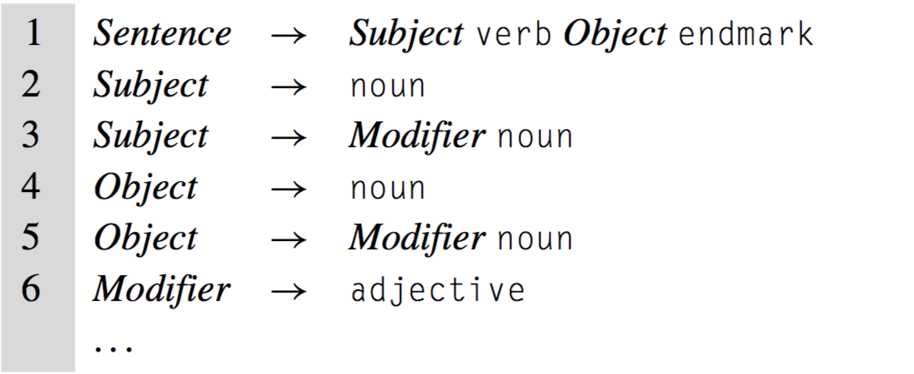
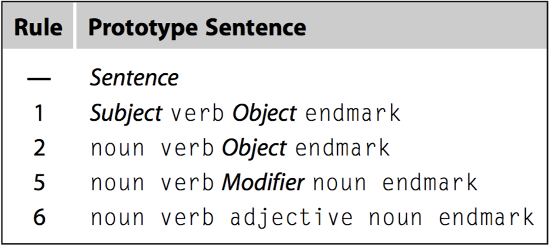

# Front End

### Purpose:

"Before the compiler can translate an expression into target machine code, 
it must understand both its form, or *syntax*, and its meaning, or *semantics*.
The front end determines if the input code is well formed, in terms of both 
syntax and semantics. If it finds that the code is valid, it creates a representation of 
the code in the compiler’s intermediate representation; if not, it reports back to the user 
with diagnostic error messages to identify the problems with the code." (Engineering a Compiler, 2nd Edition)


## Scanner

Considering a sentence like "Compilers are engineered objects." The scanner identifies distinct words 
in the input program and classifies each word with a part of speech in order to understand
the syntax of this sentence. To do so, the scanner takes a stream of characters and converts it to a 
stream of classified words—that is, pairs of the form (*p,s*), where *p* is the word’s *part of speech* 
and *s* is its spelling. A scanner would convert the example sentence into the following stream of classified words:

(Engineering a Compiler, 2nd Edition)

## Parser

In the next step, the compiler tries to match the stream of categorized words against 
the rules that specify syntax for the input language. For example, a working knowledge of English 
might include the following grammatical rules:


(Engineering a Compiler, 2nd Edition)

By inspection, we can discover the following *derivation* for our example sentence:


(Engineering a Compiler, 2nd Edition)

The derivation starts with the syntactic variable *Sentence*. At each step, it rewrites one term in 
the prototype sentence, replacing the term with a right-hand side that can be derived from that rule. 
The first step uses Rule 1 to replace *Sentence*. The second uses Rule 2 to replace *Subject*. 
The third replaces *Object* using Rule 5, while the final step rewrites *Modifier* with `adjective` according to Rule 6. 
At this point, the prototype sentence generated by the derivation matches the stream of categorized words produced by the scanner.

The derivation proves that the sentence “Compilers are engineered objects.” belongs to the language 
described by Rules 1 through 6. The sentence is grammatically correct. The process of automatically 
finding derivations is called *parsing*.

In short, the parser is a compiler pass that determines if the input stream is a sentence in the language source.

## Intermediate Representation (IR)

The final issue handled in the front end of a compiler is the generation of an ir form of the code. 
Compilers use a variety of different kinds of ir, depending on the source language, the target language, 
and the specific trans- formations that the compiler applies. Some irs represent the program as a graph. 
Others resemble a sequential assembly code program


## Grammar

```
program					→ declaration* eof;

declaration				→ var-declaration
						| statement ;

statement				→ expression-statement
						| print-statement
						| block;

block					→ '{' declaration* '}' ;

var-declaration			→ 'var' IDENTFIER ('=' expression)? ;

primary					→ 'true' | 'false' | 'null' | 'this'
						| NUMBER | STRING
						| '(' expression ')'
						| IDENTIFER

expression				→ assignment ;

assignment				→ IDENTIFIER '=' assignment
						| equality
```